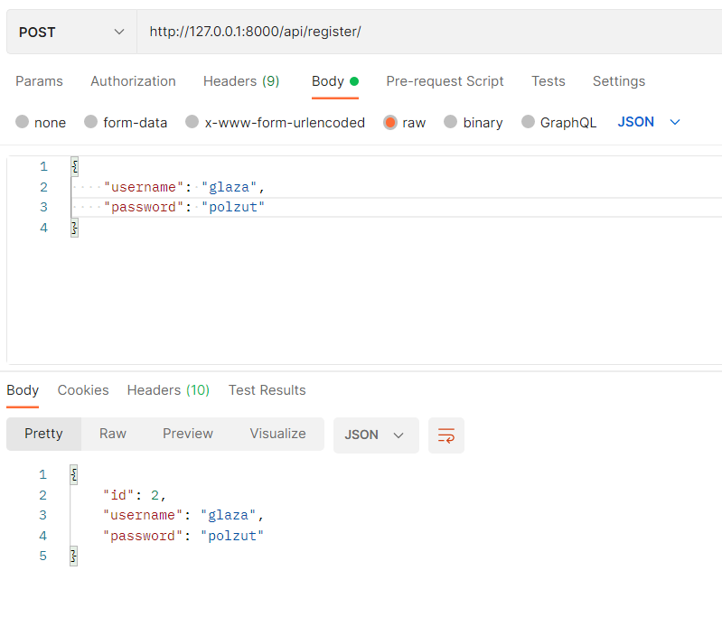
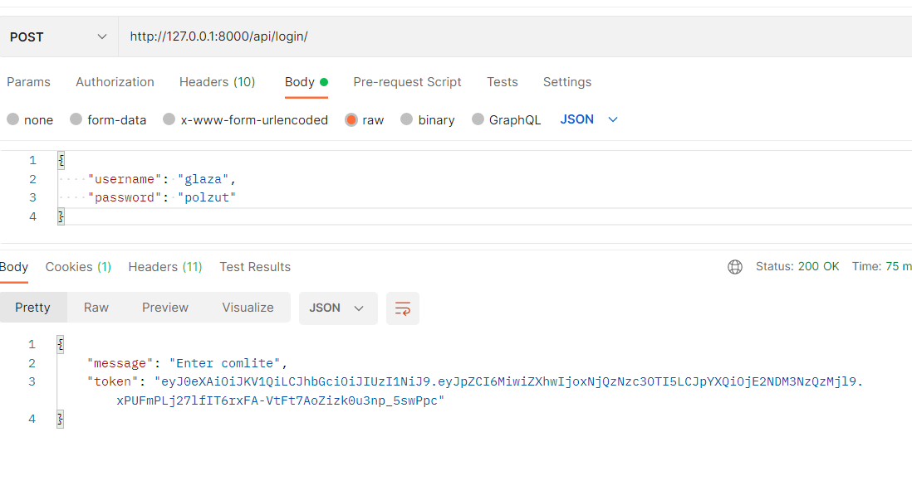
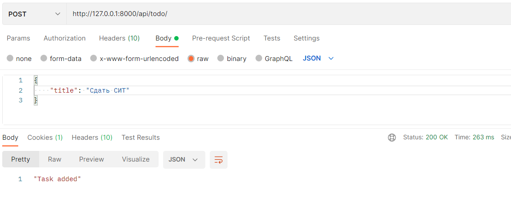
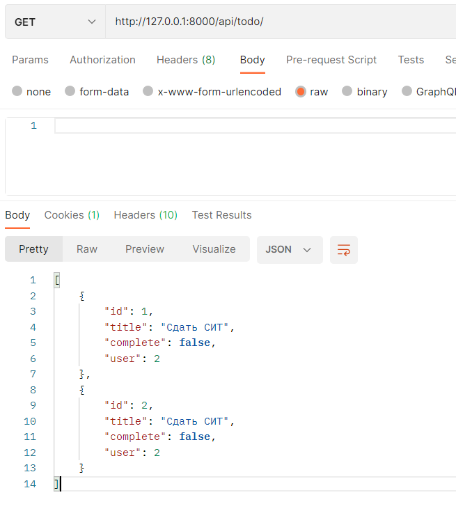
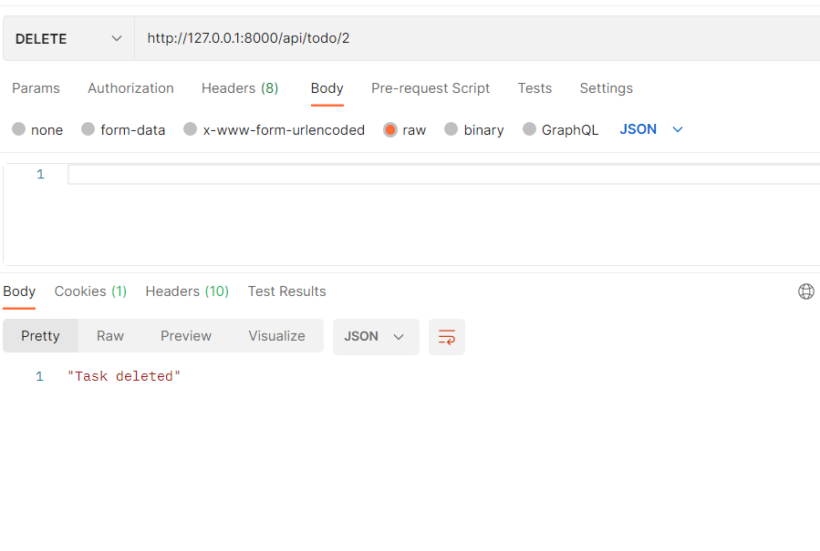
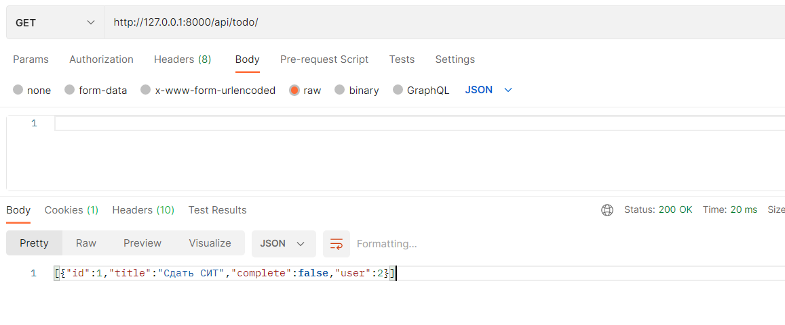
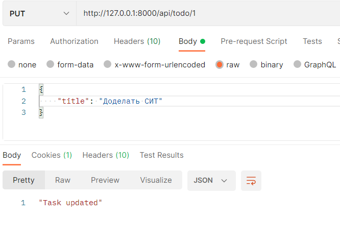
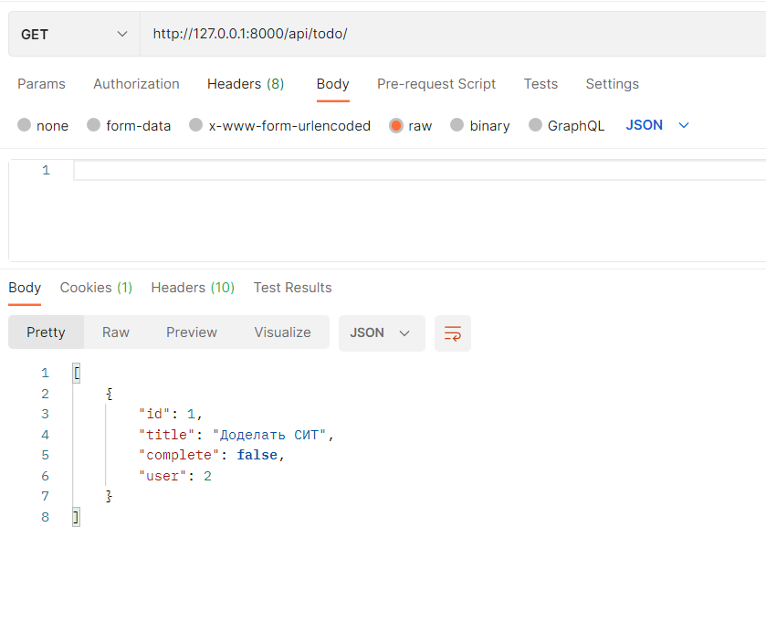

Создаём нового пользователя чезер Postman

Выполним вход

Создаём задачу

Просмотр задач(Вторая такая же задача появилась так как я случайно дважды POST сделал на предыдущем шаге)

Удалим задачу

Проверям удаление

Обновим задачу

Проверим обновление
